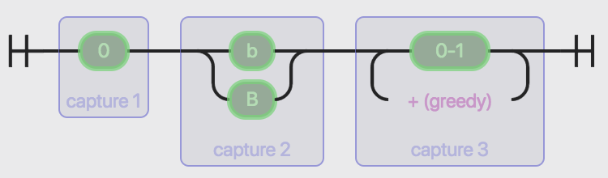
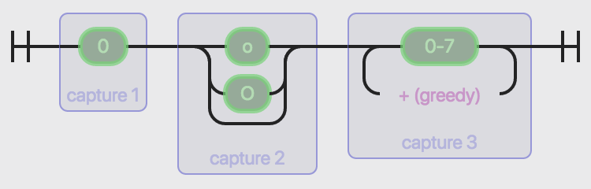
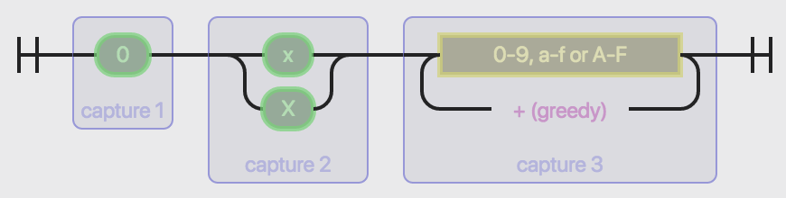
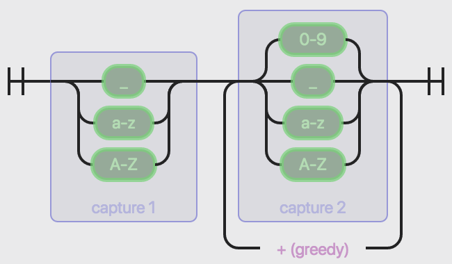
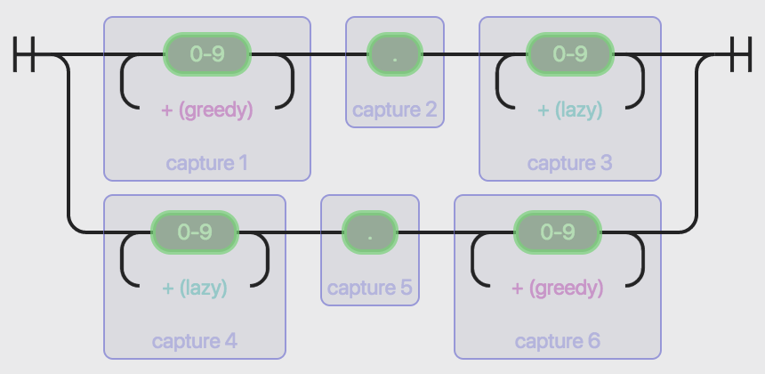
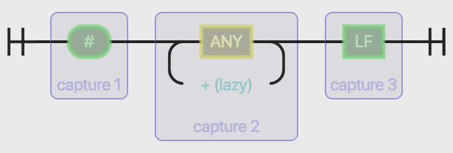
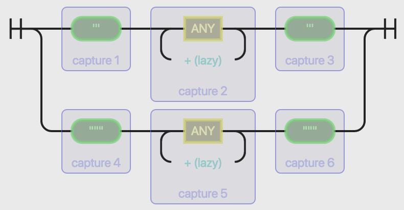
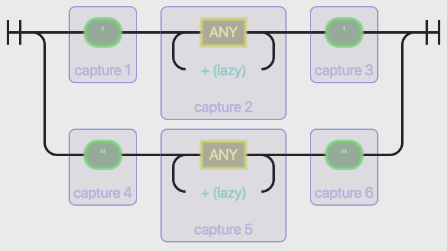
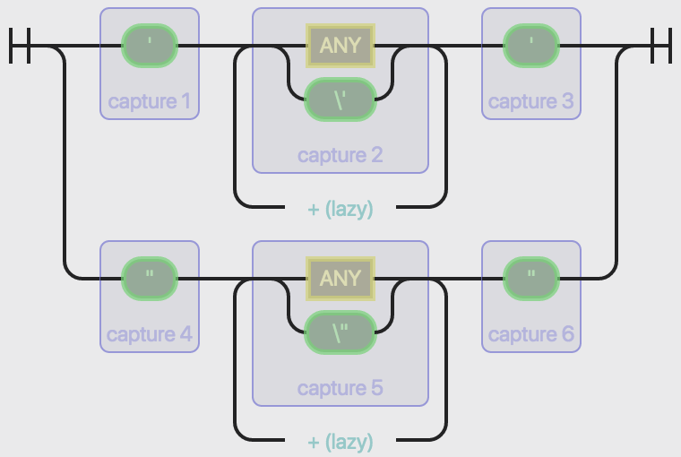

# 编译原理课程实践1报告

### 1. 实践内容

&emsp;&emsp;用 `Lex` 对用户输入的 `Python` 脚本文件（只含英文）进行分析处理，并完成以下功能：

 - 进制转换

 > &emsp;&emsp;在不影响代码运行结果的前提下，要求对 `Python` 脚本分析处理，将代码中的**非十进制数**转换为**十进制数**。

  - 将注释中大写字母转换为小写字母

  > &emsp;&emsp;`Python` 中用 `#` 表示**单行注释**，而没有单独用于多行注释的符号；一般使用三引号 `'''` 或 `"""` 字符串作为**多行注释**。这里假设三引号字符串仅用于多行注释。要求将注释中的大写字母转换为小写字母。

&nbsp;

##### 原始输入的代码：

```python
#!/usr/bin/env python

'''Main  FUCTION'''   
def  main():
    a = (0o21 + 0x1c) * 2   # 0o21 equals 17
    b = 0b1001 * 0O37   # 0b1001 eqUALs 9
    c = 0XA1 - 55   # 0XA1 equals 161
    d = 0101   # 0101 EQUALS 65
    print a + b - c - d
'''END'''

if   __name__  ==  '__main__':
    """    
    CALL
    main function
    """
    main()  
```

##### 转换输出的代码：

```python
#!/usr/bin/env python

'''main  fuction'''
def  main():
    a = (17 + 28) * 2   # 0o21 equals 17
    b = 9 * 31   # 0b1001 equals 9
    c = 161 - 55   # 0xa1 equals 161
    d = 65   # 0101 equals 65
    print a + b - c - d
'''end'''

if   __name__  ==  '__main__':
    """
    call
    main function
    """
    main()
```

&nbsp;

### 2. 实践环境

#### 2.1 测试环境

 - `Debian` Kali Linux 4.6.0 AMD64 VM (pre-made)

 - `gcc` 6.3.0

 - `flex` 2.6.1

#### 2.2 测试脚本

```bash
$ flex flex.l                   # > lex.yy.c
$ gcc lex.yy.c -lfl             # > a.out
$ ./a.out < test.py > result.py # in default
```

&nbsp;

### 3. 实践思路

#### 3.1 进制转换

&emsp;&emsp;查阅 `Python` [官方文档](https://docs.python.org/2/reference/lexical_analysis.html#integer-and-long-integer-literals)及 [PEP 3127]( https://www.python.org/dev/peps/pep-3127/) 后不难得知，在 `Python 2` 中对**整数**有如下文法定义：

```
integer        ::=  decimalinteger | bininteger
                     | octinteger | oldoctinteger
                     | hexinteger

decimalinteger ::=  ("1"..."9")* | "0"+

bininteger     ::=  "0" ("b" | "B") ("0" | "1")+

octinteger     ::=  "0" ("o" | "O") ("1"..."7")+
oldoctinteger  ::=  "0" ("0"..."7")+

hexinteger     ::=  "0" ("x" | "X")
                     ("0"..."9" | "a"..."f" | "A"..."F")+
```

&emsp;&emsp;实践要求将**非十进制数转化为十进制数**，即将 `octinteger`、`hexinteger`、`bininteger` 和 `oldoctinteger` 全部转化为 `decimalinteger`。

##### 3.1.1 二进制数

```c
/* binary number */
BIN     ((0)(b|B)[0-1]+)

%%

{BIN} {
    /* binary to decimal */

    char * ENDPTR;
    char * STRING = &yytext[2];
    long DIGIT = strtol(STRING, &ENDPTR, 2);
    printf("%ld", DIGIT);
}
```

&emsp;&emsp;二进制数满足上述 `bininteger` 格式，在获得匹配值后，可使用 `stdlib.h` 中的 `strtol` 函数将其转化为十进制数。其 NFA 表示如下：



##### 3.1.2 八进制数

```c
/* octal number */
OCT     ((0)(o|O)[0-7]+)
OCT0    ((0)[0-7]+)

%%

{OCT} {
    /* octal to decimal */

    char * ENDPTR;
    char * STRING = &yytext[2];
    long DIGIT = strtol(STRING, &ENDPTR, 8);
    printf("%ld", DIGIT);
}

{OCT0} {
    /* octal to decimal (deprecated) */

    char * ENDPTR;
    char * STRING = &yytext[1];
    long DIGIT = strtol(STRING, &ENDPTR, 8);
    printf("%ld", DIGIT);
}
```

&emsp;&emsp;八进制数满足上述 `octinteger` 与 `oldoctinteger` 两种格式，在获得匹配值后，可分别使用 `stdlib.h` 中的 `strtol` 函数将其转化为十进制数。其综合 NFA 表示如下：



##### 3.1.3 十六进制数

```c
/* hexadecimal number */
HEX     ((0)(x|X)[0-9A-Fa-f]+)

%%

{HEX} {
    /* hexadecimal to decimal */

    char * ENDPTR;
    char * STRING = &yytext[2];
    long DIGIT = strtol(STRING, &ENDPTR, 16);
    printf("%ld", DIGIT);
}
```

&emsp;&emsp;十六进制数满足上述 `hexinteger` 格式，在获得匹配值后，可使用 `stdlib.h` 中的 `strtol` 函数将其转化为十进制数。其 NFA 表示如下：



##### 3.1.4 注意事项

###### A. 标识符

```c
/* variable name */
VAR     ([_A-Za-z][_0-9A-Za-z]*)

%%

{VAR} {
    /* do nothing to variable name */

    printf("%s", yytext);
}
```

&emsp;&emsp;需要注意的是，在上述文法中存在与 `Python` 中**变量名**或**标识符**相重叠的部分，即为后者子集。为避免误触，需将其单独列出并处理。文法定义如下：

```
identifier ::=  (letter|"_") (letter | digit | "_")*
letter     ::=  lowercase | uppercase
lowercase  ::=  "a"..."z"
uppercase  ::=  "A"..."Z"
digit      ::=  "0"..."9"
```

同理可作出其 NFA 表示如下：



###### B. 浮点数

```c
/* decimal number */
DEC     ([0-9]+(.)[0-9]*)

%%

{DEC} {
    /* do nothing to decimal number */

    printf("%s", yytext);
}
```

&emsp;&emsp;此外，在 `Python` 中仅支持十进制**浮点数**，而其中部分文法（非科学计数法表示的浮点数）存在与八进制整数 `oldoctinteger` 相重叠的部分，即后者为浮点数子集。为避免误触，需将其单独列出并处理。文法定义如下：

```
pointfloat ::= [intpart] fraction | intpart "."
intpart    ::= digit+
fraction   ::= "." digit+
```

同理可作出其 NFA 表示如下：



#### 3.2 将注释中大写字母转换为小写字母

&emsp;&emsp;根据 `Python` [官方文档](https://docs.python.org/2/reference/lexical_analysis.html#string-literals)及实践要求，在 `Python` 中对**注释**有如下文法定义：

```
comment         ::=  "#" commentchar*
commentchar     ::=  <any source character except newline>

longstring      ::=  "'''" longstringitem* "'''"
                      | '"""' longstringitem* '"""'
shortstringitem ::=  shortstringchar | escapeseq
longstringitem  ::=  longstringchar | escapeseq
shortstringchar ::=  <any source character except "\"
                      or newline or the quote>
longstringchar  ::=  <any source character except "\">
escapeseq       ::=  "\" <any ASCII character>
```

&emsp;&emsp;实践要求将**大写字母**转化为**小写字母**，即将字母 `"A"..."Z"` 依次转化为 `"a"..."z"`。

##### 3.2.1 单行注释

```c
/* one-line comment after number signs */
%x PY_COMMENT

%%

    /* one line comment after number signs */
"#"                         { BEGIN(PY_COMMENT); printf("#"); }
<PY_COMMENT>"\n"            { BEGIN(INITIAL); printf("\n"); }
<PY_COMMENT>[A-Z]           { putchar(tolower(yytext[0])); }
<PY_COMMENT>.               { putchar(yytext[0]); }
```

&emsp;&emsp;如上述 `comment` 格式所示，单行注释（inline comment）用标识符 `#` 表示起始，直至本行行末所有内容均为注释。在获取注释中的大写字母，即 `"A"..."Z"` 后，可使用 `ctype.h` 中的 `tolower` 函数将其转化为小写字母，即 `"a"..."z"`。单行注释的 NFA 可表示如下：



##### 3.2.2 多行注释

```c
/* multi-line comment in single quotes */
%x PY_SINGLE_QUOTE
/* multi-line comment in double quotes */
%x PY_DOUBLE_QUOTE

%%

    /* multi-line comment in single quotes */
"\'\'\'"                    { BEGIN(PY_SINGLE_QUOTE); printf("'''"); }
<PY_SINGLE_QUOTE>"\'\'\'"   { BEGIN(INITIAL); printf("'''"); }
<PY_SINGLE_QUOTE>[A-Z]      { putchar(tolower(yytext[0])); }
<PY_SINGLE_QUOTE>.          { putchar(yytext[0]); }

    /* multi-line comment in double quotes */
"\"\"\""                    { BEGIN(PY_DOUBLE_QUOTE); printf("\"\"\""); }
<PY_DOUBLE_QUOTE>"\"\"\""   { BEGIN(INITIAL); printf("\"\"\""); }
<PY_DOUBLE_QUOTE>[A-Z]      { putchar(tolower(yytext[0])); }
<PY_DOUBLE_QUOTE>.          { putchar(yytext[0]); }
```

&emsp;&emsp;在 `Python` 中，并无特别定义的多行注释标识符，故通常用三引号 `'''` 或 `"""` 来表示，如上述 `longcomment` 格式所示。在获取匹配的字符串内容后，便可使用 `ctype.h` 中的 `tolower` 函数将其转化为小写字母。多行注释的 NFA 可表示如下：



##### 3.2.3 注意事项

###### A. 字符串

&emsp;&emsp;由于**字符串**（string）的文法蕴含了上述单行及多行注释，即字符串中可包含与注释文法相同的内容，因此需要特殊处理。其文法定义如下：

```
shortstring     ::=  "'" shortstringitem* "'"
                      | '"' shortstringitem* '"'
shortstringitem ::=  shortstringchar | escapeseq
shortstringchar ::=  <any source character except "\"
                      or newline or the quote>
escapeseq       ::=  "\" <any ASCII character>
```

同理可作出其 NFA 表示如下：



###### B. 转义字符

```c
/* strings in single and double quotes */
%x PY_SINGLE_STRING
%x PY_DOUBLE_STRING

%%

    /* strings in single and double quotes */
"\'"                        { BEGIN(PY_SINGLE_STRING); printf("'"); }
<PY_SINGLE_STRING>"\'"      { BEGIN(INITIAL); printf("'"); }
<PY_SINGLE_STRING>\\.       { printf("%s", yytext); }
<PY_SINGLE_STRING>"\n"      { putchar(yytext[0]); }
<PY_SINGLE_STRING>.         { putchar(yytext[0]); }

"\""                        { BEGIN(PY_DOUBLE_STRING); printf("\""); }
<PY_DOUBLE_STRING>"\""      { BEGIN(INITIAL); printf("\""); }
<PY_DOUBLE_STRING>\\.       { printf("%s", yytext); }
<PY_DOUBLE_STRING>"\n"      { putchar(yytext[0]); }
<PY_DOUBLE_STRING>.         { putchar(yytext[0]); }
```

&emsp;&emsp;在 `Python` 语法中，存在用反斜线（backslash）表示的**转义字符**，如表示换行符的 `\n` 等。因此，在字符串的匹配过程中，还应注意到转义引号，即 `\'` 和 `\"` 特殊情况。故上述字符串 NFA 应修改如下：



&nbsp;

### 4. 实践感想

&emsp;&emsp;总的来说，本次实践难度不大。但对于熟悉和掌握 `Lex` 词法分析工具，十分有效且到位。

&emsp;&emsp;代码实现的整体思路已在前文中进行了详尽的介绍。这里需要指出的是，在实现注释和字符串的词法匹配时，我采取了不同于普通正则表达式匹配的方式，即状态匹配。通过 `BEGIN` 和 `INITIAL` 关键字，记录和还原匹配状态，并利用正则对其中的匹配字符或字符串进行“定制化”处理。因此，在注释和字符串的匹配过程中，我并未强调针对数字的处理方案——而这是在正则表达式匹配中，需要注意的问题。

&emsp;&emsp;最后，希望助教小哥哥能够高抬贵手【误】下一次大作业也这么小清新就好惹 :)
